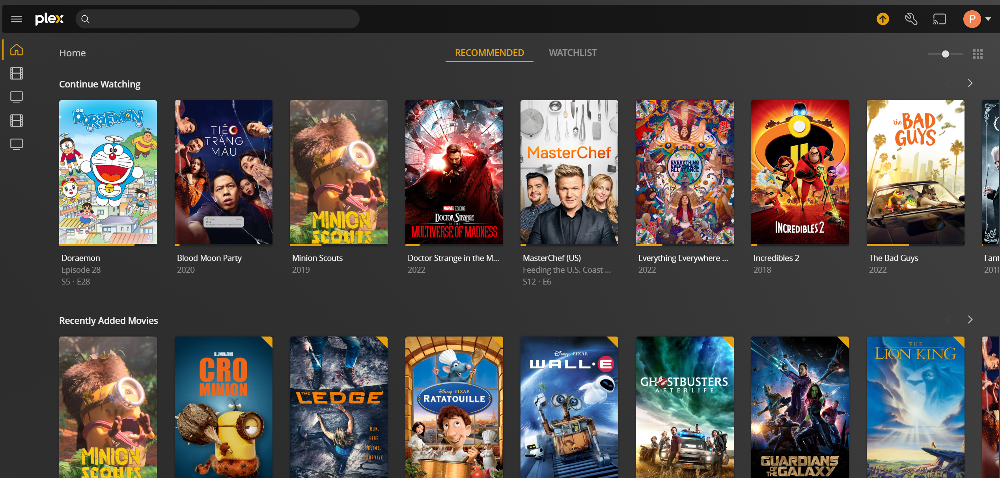

# Plex Media Server

## Prerequisites

* [Ubuntu 20.04 OS](https://ubuntu.com/download/server)
* [Docker Engine & Docker Compose](https://github.com/phamumb/home-lab-docsify/blob/main/docs/plex-server/docker/install-docker.md)
* [Docker NVIDIA container](https://github.com/phamumb/home-lab-docsify/blob/main/docs/plex-server/docker/nvidia-container.md)
* [RAID Array Level 5](https://github.com/phamumb/home-lab-docsify/blob/main/docs/plex-server/raid-array/create-raid-array.md)
* [PURE VPN](https://purevpn.com)

## Download Clients

### SABNzbd

### Transmission

## Indexers

### Jackett

### NZBGeek

### NZBPlanet

## Services

### Radarr

### Sonarr

### Bazarr

## Requesting

### Overseerr
