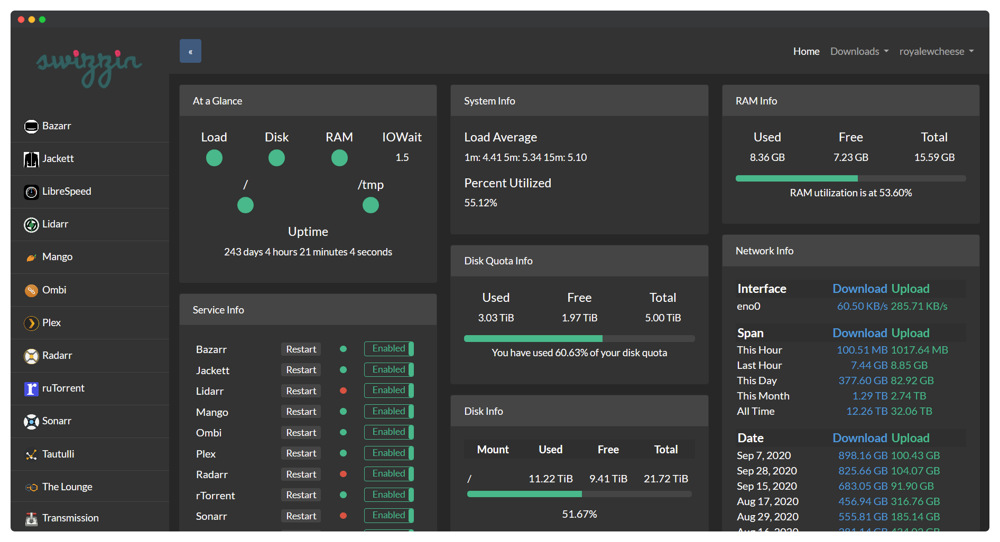

# Swizzin

An all-in-one seedbox solution for Ubuntu and Debian 

## Quick start

Get up and running within minutes

Use the following commands as root to get the swizzin installer up and running. Depending on your choice of packages and your CPU, you can have your applications up and running within just a few minutes!

#### **curl**

bash <(curl -sL git.io/swizzin) && . \~/.bashrc

#### **wget**

bash <(wget -qO - git.io/swizzin) && . \~/.bashrc

## Resources

* [Application](https://swizzin.ltd/applications)
* [Docs](https://swizzin.ltd/getting-started)
