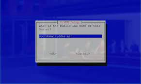
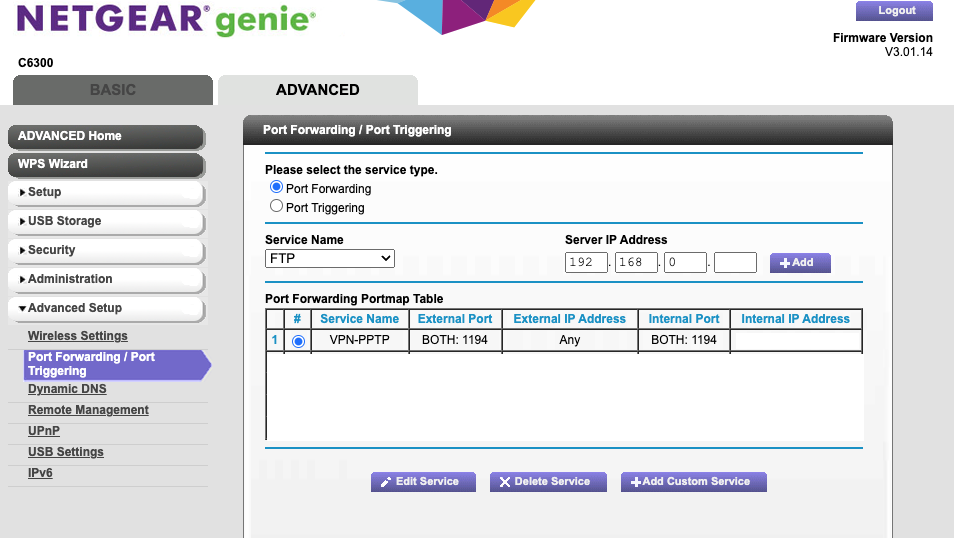

# PiVPN

## Setting up No-ip account with your router

* Go to no-ip.com to sign up for an account, after signing up, navigate to 'Dynamic DNS' and click on 'No-IP Hostnames'. You will need to pick your hostname for example mydomain.ddns.net or any name that you want.

<figure><figcaption></figcaption></figure>

* After no-ip account is setup, now go back to your local network and look for your router ip address, in my case I'm using a Netgear router so it will be 192.168.0.1
* Inside your router web page, look for the DDNS section and fill in the no-ip account that you created above, depending on what DDNS provider your router support. It does not have to be No-ip. In my case, I'll pick no-ip as my provider.

<figure><figcaption></figcaption></figure>

## Installing PiVPN on your server

Following are instructions from this website to download and launch the installation screen. After going through all initial steps, at the DDNS screen, you should fill in your domain from no-ip hostnames setting up above

<figure><figcaption>
Choose DNS Entry as your option
</figcaption></figure>

<figure><figcaption>
Filling in your ddns domain name
</figcaption></figure>

After doing all steps above, now go back to the router web page and navigate to Port Forwarding setup and fill in your PiVPN host server ip address with port 1194. And you should be good to use.

<figure><figcaption></figcaption></figure>

